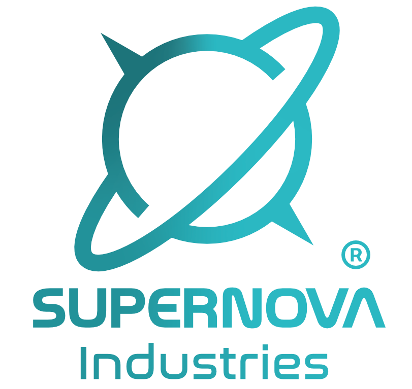

<p align="center"></p>

# Unlook OS

Appliance image for the **Unlook 3D scanner** (Raspberry Pi CM5) by Supernova
Industries: Raspberry Pi OS Lite 64-bit (bookworm) built with pi-gen, the
[`unlook-sdk`](unlook-sdk/) daemon started at every boot, the Mira220 stereo
camera stack with hardware sync, A/B system updates (signed RAUC bundles,
automatic rollback) and SDK updates from GitHub.

Full design: **[docs/OS.md](docs/OS.md)** · SDK interface:
[docs/SDK_CHANGES.md](docs/SDK_CHANGES.md) · Engineering contract: [CLAUDE.md](CLAUDE.md)

---

## 1. Build (macOS Apple Silicon, Linux, or Windows WSL2)

Everything builds **inside Docker**: the host needs only Docker and git.
An Apple Silicon Mac is the best host (arm64 runs natively; on an x86 host the
same commands work through emulation but take hours).

### 1.1 One-time setup

1. **Docker Desktop** — https://www.docker.com/products/docker-desktop/ ,
   start it, then *Settings → Resources*: CPUs = all, **Memory ≥ 8 GB**,
   **Disk ≥ 100 GB**. Apply & restart.
2. **git** with access to the private repositories (`unlook-os`, `unlook-sdk`):
   ```bash
   xcode-select --install          # macOS: installs git
   git --version
   ```
   If `git clone` asks for a password, log in with a GitHub token or set up
   `gh auth login` (GitHub CLI: `brew install gh`).
3. The checkout path must not contain spaces.

### 1.2 Get the sources

```bash
cd ~
git clone --recurse-submodules https://github.com/SupernovaIndustries/unlook-os.git
cd unlook-os
git submodule update --init --recursive      # safe to repeat
```

### 1.3 Build everything

```bash
scripts/docker-build.sh all
```

What it does, in order (you can also run the steps one by one):

| Step | Command | Output | Time (M-series Mac) |
| --- | --- | --- | --- |
| packages | `scripts/docker-build.sh debs` | `debs/`: OpenCV 4.10 (first time only), `unlook-libcamera` (ams fork, first time only), `libunlook-sdk` + `-dev` (every time); dev signing keys in `keys/dev/` (first time) | 1–1.5 h first time, ~10 min after |
| image | `scripts/docker-build.sh image` | `deploy/unlook-os-<ver>.img.xz` (+ slot images, package list) | 30–60 min |
| bundle | `scripts/docker-build.sh bundle` | `deploy/unlook-os-<ver>.raucb` (OS update, signed with the dev key) | 5 min |

Debug shell inside the builder: `scripts/docker-build.sh shell`.
Start over from scratch: `rm -rf build deploy debs && docker volume rm unlook-pigen-work`.

> The image is signed with **development keys** (`keys/dev/`, git-ignored):
> units flashed with it only accept bundles from the same `keys/dev/`. Keep
> that folder (back it up) for as long as you test with those units.

### 1.4 Rebuild after changes

```bash
git pull --recurse-submodules
git submodule update --init --recursive
scripts/docker-build.sh debs        # new SDK commit
scripts/docker-build.sh image
scripts/docker-build.sh bundle      # a newer build = a valid OS update for units running the older one
```

---

## 2. Flash

**SD card / USB stick (Mac):** Raspberry Pi Imager → *Choose OS → Use custom* →
`deploy/unlook-os-<ver>.img.xz` → **no OS customisation** (Unlook OS ignores it).
Or from the terminal:
```bash
diskutil list                                   # find the card, e.g. /dev/disk4
diskutil unmountDisk /dev/disk4
xz -dc deploy/unlook-os-*.img.xz | sudo dd of=/dev/rdisk4 bs=4m
diskutil eject /dev/disk4
```

**CM5 eMMC:** put the carrier in USB-boot mode (nRPIBOOT jumper), connect USB-C,
run `rpiboot` (Mac: `brew install libusb pkg-config`, then build
https://github.com/raspberrypi/usbboot with `make`, run `sudo ./rpiboot -d mass-storage-gadget64`),
then flash the disk that appears exactly as above.

### 2.1 Before the first boot: access for testing

SSH is **off** and all passwords are locked by design. For testing, after
flashing, the FAT volume **`UNLOOKBOOT`** is mounted on the Mac. Create:

```bash
mkdir -p /Volumes/UNLOOKBOOT/unlook
cp ~/.ssh/id_ed25519.pub /Volumes/UNLOOKBOOT/unlook/authorized_keys   # your public key
touch /Volumes/UNLOOKBOOT/unlook/ssh                                   # enable SSH
# optional: SDK updates from GitHub need a read-only deploy key of unlook-sdk
cp ~/unlook-sdk-deploy-key /Volumes/UNLOOKBOOT/unlook/sdk-deploy-key
# optional: production profile
cp my_profile.yaml /Volumes/UNLOOKBOOT/unlook/scanner_profile.yaml
diskutil eject /Volumes/UNLOOKBOOT
```
(No key yet? `ssh-keygen -t ed25519` on the Mac.) The files are consumed and
deleted at boot (the profile stays for factory resets).

**Connect** with a USB-C cable (the unit is `10.43.0.1`, the Mac gets an
address by DHCP) or Ethernet:
```bash
ssh unlook-admin@10.43.0.1
```

---

## 3. Test on the CM5 (checklist)

Run on the unit (`ssh unlook-admin@10.43.0.1`, then `sudo -i`). Tick each one.

**Boot, identity, layout**
```bash
cat /etc/unlook-os-release                    # VERSION, SDK_VERSION, KEYRING_KIND=dev
hostname                                      # UNLK-xxxxxx
lsblk -o NAME,PARTLABEL,SIZE,MOUNTPOINTS      # cfg, boot-a/b, root-a/b, data (grown to the full disk)
journalctl -t unlook-firstboot                # data grown, audit key, unit id, pairing code
systemctl --failed                            # should be empty (unlook-health too, once cameras work)
```

**Cameras (Mira220 master/slave)** — sync cable J6↔J4 in, switches in position 2
```bash
dmesg | grep -iE 'mira220|MASTER mode|SLAVE mode'          # driver bound, CAM0 master, CAM1 slave
v4l2-ctl --list-devices                                      # two sensors
grep -A3 -i cam /sys/kernel/debug/regulator/regulator_summary   # cam regulator ON (always-on)
i2ctransfer -f -y 10 w2@0x54 0x10 0x03 r1                    # CAM0 0x1003 = 0x10 (master)
i2ctransfer -f -y 0  w2@0x54 0x10 0x03 r1                    # CAM1 0x1003 = 0x08 (slave, while streaming)
ls -l /usr/local/share/libcamera/ipa/rpi/pisp/mira220-sync.json   # -> mira220.json
```

**Daemon and protocol**
```bash
systemctl status unlook-stream --no-pager
journalctl -u unlook-stream -b | grep -iE 'camera|order|MASTER|SLAVE'   # start order master -> slave
printf 'status\nquit\n' | nc -q1 127.0.0.1 5556     # ...;camera=ok;ota=idle
/usr/lib/unlook-os/ucp-ping 127.0.0.1 5556 3 camera; echo "health probe: $?"   # 0 = healthy
```

**Phone** — pairing code: `journalctl -t unlook-firstboot -g "pairing code"`
(or `unlook_stream --pairing-code`). In the app: scan the QR / enter the code →
BLE pairing → hotspot `Unlook-xxxxxx` → preview → scan. Then reboot the unit
and check the phone reconnects **without any login on the unit**.

**USB-C gadget** — on the Mac: `ls /dev/tty.usbmodem*` (serial UCP) and
`ping 10.43.0.1`.

**Security**
```bash
ss -tulpn                                     # only 5555, 5556 (+ 22 while SSH is on, 53/67 on shared links)
nft list ruleset | head -40
unlook-ssh status                             # enabled (you enabled it for testing)
```

**SDK update from GitHub** (needs the deploy key, internet on Ethernet/Wi-Fi client)
```bash
unlook-ota check                              # SDK: installed X, available git.<sha> (after a new commit)
unlook-ota apply sdk --foreground             # fetch, build on the unit (~15-30 min), install, health check
unlook-ota status ; unlook-ota history
```

**OS update A/B + rollback** — copy a newer bundle (build it after the image) to the unit:
```bash
scp deploy/unlook-os-<newer>.raucb unlook-admin@10.43.0.1:/home/unlook-admin/     # on the Mac
sudo unlook-ota apply os --bundle /home/unlook-admin/unlook-os-<newer>.raucb      # on the unit: installs, reboots
# after the reboot:
rauc status ; unlook-ota status               # committed, booted slot B
```
Rollback test: apply another newer bundle, and within 2 minutes of the reboot
run `sudo systemctl stop unlook-stream` → the unit reboots by itself into the
previous slot; `unlook-ota status` shows `rolled_back … health_timeout`.
Power-cut test: pull the power during the first boot of the new slot → the next
boot is the previous slot (`tryboot_failed`).

**When done testing:** `sudo unlook-ssh disable`.

Report back: the output of any failing step plus `journalctl -b --no-pager > boot.log`.

---

## 4. Repository map

| Path | What |
| --- | --- |
| `scripts/docker-build.sh` | the build entry point (Docker) |
| `config/unlook-os.conf` | every build setting |
| `stages/stage-unlook/` | pi-gen stage: packages, camera stack, SDK, system, branding, export |
| `overlays/`, `drivers/mira220-sync/` | camera-enable overlay; Mira220 master/slave driver (submodule) |
| `libcamera/`, `opencv/` | `.deb` builds of the ams libcamera fork and OpenCV 4.10 |
| `image/`, `rauc/` | A/B GPT image, signed update bundles |
| `stages/stage-unlook/overlay/` | files shipped in the image (`unlook-ota`, `unlook-health`, `unlook-ssh`, units, firewall …) |
| `tests/` | unit tests (`sh tests/unit/run.sh`), QEMU boot test |

© Supernova Industries. All rights reserved.
